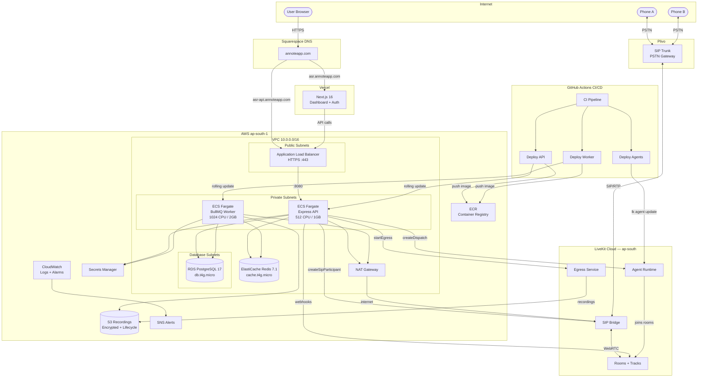

# Voice Agent Platform

**Production telephony infrastructure for voice AI.** Bridge real phone calls, capture per-speaker audio, collect consent via DTMF, and deploy AI agents into live calls — built on LiveKit + Plivo SIP.

> **Live:** `https://asr-api.annoteapp.com` (API) | `https://asr.annoteapp.com` (Dashboard)

---

## Architecture



---

## How It Works

### The Call Flow

1. User clicks **Start Capture** in the dashboard
2. API creates 3 LiveKit rooms: `consent-a`, `consent-b`, `capture`
3. Consent agents are dispatched to consent rooms
4. Both phones are dialed via SIP (`createSipParticipant` through Plivo)
5. Each caller hears a pre-recorded consent message, presses **1** (DTMF) to agree
6. Callers are moved to the capture room (`moveParticipant`)
7. Announce agent plays "This call is being recorded"
8. 3 egresses start: mixed + per-speaker recordings to S3
9. When either party hangs up, recordings are enqueued for processing
10. BullMQ worker transcribes audio via Gemini STT, slices utterances, saves to DB

### Consent + DTMF

Recording consent is legally required. Each caller is isolated in their own consent room where an agent plays a pre-recorded WAV message and listens for DTMF digit "1". Consent is communicated back to the API via LiveKit room metadata, resolved through both webhooks and polling for reliability.

### Per-Speaker Recording

LiveKit's `startParticipantEgress` records each caller's phone mic as a separate audio file — no AI diarization needed. This gives clean, isolated audio per speaker for ASR training data.

---

## Stack

| Layer | Technology |
|---|---|
| **Telephony** | [LiveKit Cloud](https://cloud.livekit.io) (ap-south) — rooms, SIP bridge, egress, agent dispatch |
| **PSTN** | [Plivo](https://www.plivo.com) — SIP trunk, outbound calling |
| **Backend** | Express + TypeScript, Drizzle ORM, pino, zod |
| **Frontend** | Next.js 16 App Router, shadcn/ui, TanStack Query |
| **Auth** | Better Auth — phone number OTP |
| **Agents** | LiveKit Agents SDK (Node.js) — consent + announce agents |
| **Queue** | BullMQ + Redis — durable audio processing pipeline |
| **Transcription** | Google Gemini STT |
| **Storage** | AWS S3 (encrypted, lifecycle: Standard → IA → Glacier) |
| **Database** | AWS RDS PostgreSQL 17 (encrypted, 7-day backups) |
| **Cache** | AWS ElastiCache Redis 7.1 |
| **Compute** | AWS ECS Fargate (API + Worker services) |
| **Networking** | AWS VPC, ALB with TLS 1.3, NAT Gateway, S3 VPC Endpoint |
| **CI/CD** | GitHub Actions — OIDC auth, no static AWS keys |
| **Monitoring** | CloudWatch alarms, Container Insights, SNS alerts |

---

## Infrastructure

### AWS (ap-south-1 / Mumbai)

```
VPC (10.0.0.0/16) — 2 AZs
├── Public Subnets    → ALB (HTTPS, TLS 1.3)
├── Private Subnets   → ECS API (2-10 tasks) + ECS Worker (1-3 tasks)
├── Database Subnets  → RDS PostgreSQL 17 (encrypted, Performance Insights)
├── ElastiCache       → Redis 7.1 (BullMQ job queue)
├── S3                → Recordings (versioned, lifecycle, encrypted)
├── NAT Gateway       → Single NAT ($35/mo)
├── S3 VPC Endpoint   → Free, bypasses NAT for S3 traffic
├── ECR               → API + Worker container registries
├── Secrets Manager   → All app secrets (DB URL, API keys)
├── ACM               → TLS certificate for asr-api.annoteapp.com
└── CloudWatch        → CPU/5xx/storage alarms → SNS
```

### LiveKit Cloud (ap-south / India)

```
LiveKit Project
├── SIP Bridge       → Plivo outbound trunk (ST_xxx)
├── Rooms            → Consent rooms + Capture rooms
├── Egress           → Per-speaker + mixed recordings → S3
├── Agent Runtime    → telephony-agent (consent + announce)
└── Krisp            → AI noise cancellation on SIP participants
```

### Monthly Cost Estimate

| Resource | Cost |
|----------|------|
| ECS API (2 tasks) | ~$30 |
| ECS Worker (1 task) | ~$22 |
| RDS PostgreSQL (t4g.micro) | ~$15 |
| ElastiCache Redis (t4g.micro) | ~$13 |
| NAT Gateway | ~$35 |
| ALB | ~$20 |
| S3 + ECR + CloudWatch | ~$10 |
| LiveKit Cloud (Scale) | $500 + usage |
| Plivo PSTN (India, 2 legs) | ~$5,000-8,000 |
| **Total** | **~$5,645-8,645/mo** |

> Infrastructure cost is ~$145/mo. The majority is Plivo PSTN (phone calls to India).

---

## Project Structure

```
apps/
  web/              Next.js 16 — dashboard, auth, capture management
  api/              Express — LiveKit orchestration, SIP calls, webhooks
  agents/           LiveKit Agents — consent + announce (deployed to LiveKit Cloud)
  workers/          BullMQ worker — audio processing pipeline (Gemini STT)

packages/
  db/               Drizzle ORM schema + queries (shared)
  types/            Shared TypeScript types
  queues/           BullMQ queue definitions (shared between API + worker)

infra/
  bootstrap/        Terraform — S3 state bucket + DynamoDB lock table
  environments/
    prod/           Terraform — VPC, ECS, RDS, Redis, ALB, S3, IAM, monitoring

.github/
  workflows/
    ci.yml              Typecheck + build + Docker build
    deploy-api.yml      Build → ECR → ECS rolling update (API)
    deploy-worker.yml   Build → ECR → ECS rolling update (Worker)
    deploy-agents.yml   lk agent update → LiveKit Cloud
```

---

## CI/CD

All deployments use **GitHub Actions with OIDC** — no static AWS access keys.

| Workflow | Trigger | What it does |
|----------|---------|-------------|
| `ci.yml` | Push to main/feat/* | Typecheck API + Web, Next.js build, Docker build |
| `deploy-api.yml` | Push to `apps/api/**` | Build amd64 image → ECR → ECS rolling update |
| `deploy-worker.yml` | Push to `apps/workers/**` | Build amd64 image → ECR → ECS rolling update |
| `deploy-agents.yml` | Push to `apps/agents/**` | `lk agent update` → LiveKit Cloud (ap-south) |

---

## Quick Start

### Prerequisites

- Node.js 22+ and pnpm 10+
- PostgreSQL running locally (`createdb telephony`)
- Docker Desktop
- [LiveKit Cloud](https://cloud.livekit.io) project with SIP outbound trunk
- [Plivo](https://www.plivo.com) account with a phone number

### Setup

```bash
git clone https://github.com/HrushiBorhade/voice-agent-platform.git
cd voice-agent-platform
cp .env.example .env   # fill in your credentials
pnpm install
```

### Run Locally

```bash
# Start database + Redis
docker compose -f docker-compose.dev.yml up -d

# Apply DB schema
pnpm --filter @repo/db db:push

# Start services (3 terminals)
pnpm --filter api dev          # Express API on :8080
pnpm --filter web dev          # Next.js on :3000
pnpm --filter @repo/agents dev # LiveKit agent (combined)
```

### Deploy Infrastructure

```bash
# 1. Bootstrap state backend
cd infra/bootstrap && terraform init && terraform apply

# 2. Deploy all resources
cd infra/environments/prod && terraform init && terraform apply

# 3. Push initial images (CI handles subsequent deploys)
# 4. Populate secrets in AWS Secrets Manager
# 5. Force ECS redeploy
```

See [docs/DEPLOYMENT_GUIDE.md](docs/DEPLOYMENT_GUIDE.md) for detailed steps.

---

## LiveKit SIP Setup

You need a Plivo SIP trunk connected to LiveKit. The outbound trunk is created once:

```typescript
const trunk = await sipClient.createSipOutboundTrunk(
  'Plivo Outbound',
  'XXXXXXXXXXXX.zt.plivo.com',  // Plivo termination domain
  ['+91XXXXXXXXXX'],             // Your Plivo phone number
  { auth_username: '...', auth_password: '...' }
);
// Save trunk.sipTrunkId as LIVEKIT_SIP_TRUNK_ID
```

See [Plivo + LiveKit Integration Guide](https://www.plivo.com/docs/voice-agents/sip-trunking/integration-guides/livekit) for dashboard setup.

---

## Roadmap

- [x] Two-party call capture with per-speaker audio separation
- [x] Phone number authentication (OTP)
- [x] DTMF-based recording consent (legally compliant)
- [x] AI agents in calls (consent + announce agents)
- [x] Pre-recorded WAV playback (zero TTS latency for consent/announce)
- [x] BullMQ audio processing pipeline (Gemini STT)
- [x] Production AWS infrastructure (Terraform)
- [x] CI/CD with GitHub OIDC (no static keys)
- [x] LiveKit Cloud agent deployment (ap-south)
- [ ] Voice AI agent evaluation (inject eval agent into live calls)
- [ ] Real-time transcription streaming
- [ ] Voice AI agent builder (STT → LLM → TTS pipeline)
- [ ] Multi-party rooms (>2 participants)
- [ ] Transcript viewer with word-level timestamps

---

## Contributing

Issues and PRs welcome — especially around ASR integration and agent participation patterns.
